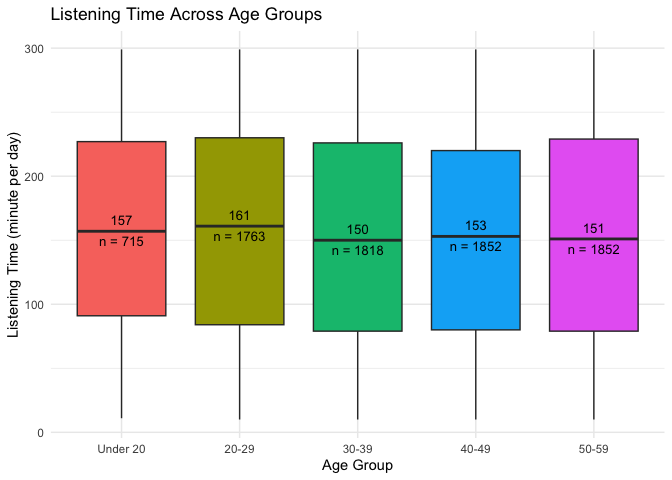
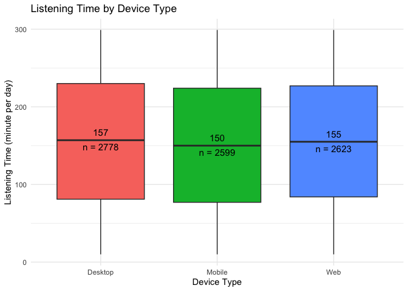
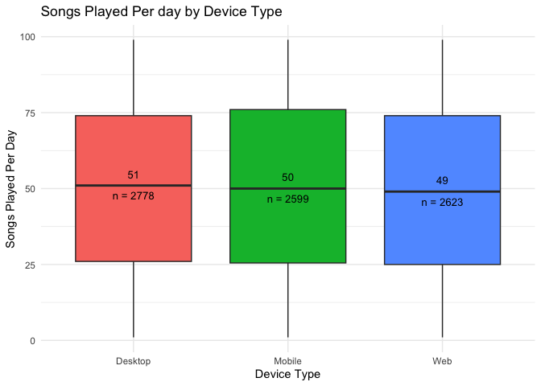

# Programming for Business Analytics (PBA) – Final Project
(Ken) Kanokphan Thananchai - 112065431, (Fern) Wachiraporn Tianchot -
112550081

- [Part 1: Data and Proposal](#part-1-data-and-proposal)
  - [Data resource](#data-resource)
  - [Proposal](#proposal)
  - [Purpose](#purpose)
  - [Variables](#variables)
  - [Questions](#questions)
- [Part 2: Data Visualization](#part-2-data-visualization)
  - [Set Up the Environment](#set-up-the-environment)
  - [Visualization No.1](#visualization-no1)
  - [Visualization No.2](#visualization-no2)
  - [Visualization No.3](#visualization-no3)
  - [Visualization No.4](#visualization-no4)
  - [Visualization No.5](#visualization-no5)
  - [Visualization No.6](#visualization-no6)

## Part 1: Data and Proposal

### Data resource

- [\[Kaggle\] Spotify Analysis Dataset
  2025](https://www.kaggle.com/datasets/nabihazahid/spotify-dataset-for-churn-analysis)

### Proposal

We will analyze Spotify dataset with user-level behavior (listening
time, skips), plan type (Free/Premium), ads exposure, devices,
demographics, and a churn flag. This lets us explore engagement patterns
and illustrate churn/upgrade dynamics in a transparent, visual way.

### Purpose

Explain who is active, who is likely to churn, and who is likely to
upgrade to Premium then translate those insights into simple, testable
actions (upsell targeting, ad-light trials, playlist nudges) to improve
retention and conversion.

### Variables

| Variable                | Detail                                    |
|-------------------------|-------------------------------------------|
| `user_id`               | Unique identifier for each user           |
| `gender`                | Male/Female/Other                         |
| `age`                   | User age                                  |
| `country`               | User Location                             |
| `subscription_type`     | Free, Premium, Family, Student            |
| `listening_time`        | Minutes spent listening per day           |
| `songs_played_per_day`  | Number of songs played daily              |
| `skip_rate`             | Percentage of songs skipped               |
| `device_type`           | Device used (Mobile, Desktop, Web)        |
| `ads_listened_per_week` | Number of ads heard per week              |
| `offline_listening`     | Offline mode usage                        |
| `is_churned`            | Target variable (0 = Active, 1 = Churned) |

### Questions

1.  Which countries have the most active Spotify users?

2.  Which countries have the most premium or free Spotify users?

3.  How do listening time and songs played per day vary across age
    groups and gender?

4.  Which factors (listening_time, skip_rate, ads exposure, device, age)
    best predict churn probability?

5.  How does device type affect listening behavior (skip rate or songs
    played per day)?

6.  How do ads listening weekly relate to listening time and skip rate?

7.  Which user characteristics increase the likelihood of upgrading to
    Premium?

------------------------------------------------------------------------

## Part 2: Data Visualization

### Set Up the Environment

- Load the libraries.

``` r
library(ggplot2)
library(dplyr)
```


    Attaching package: 'dplyr'

    The following objects are masked from 'package:stats':

        filter, lag

    The following objects are masked from 'package:base':

        intersect, setdiff, setequal, union

``` r
library(sf)
```

    Linking to GEOS 3.13.0, GDAL 3.8.5, PROJ 9.5.1; sf_use_s2() is TRUE

``` r
library(rnaturalearth)
library(stringr)
library(scales)
```

- Load data.

  ``` r
  data <- read.csv("spotify_churn_dataset.csv")
  ```

  - Show some examples.

  ``` r
  head(data)
  ```

        user_id gender age country subscription_type listening_time
      1       1 Female  54      CA              Free             26
      2       2  Other  33      DE            Family            141
      3       3   Male  38      AU           Premium            199
      4       4 Female  22      CA           Student             36
      5       5  Other  29      US            Family            250
      6       6 Female  17      AU              Free            219
        songs_played_per_day skip_rate device_type ads_listened_per_week
      1                   23      0.20     Desktop                    31
      2                   62      0.34         Web                     0
      3                   38      0.04      Mobile                     0
      4                    2      0.31      Mobile                     0
      5                   57      0.36      Mobile                     0
      6                   35      0.46     Desktop                    13
        offline_listening is_churned
      1                 0          1
      2                 1          0
      3                 1          1
      4                 1          0
      5                 1          1
      6                 0          0

  - Show data structure.

  ``` r
  str(data)
  ```

      'data.frame':   8000 obs. of  12 variables:
       $ user_id              : int  1 2 3 4 5 6 7 8 9 10 ...
       $ gender               : chr  "Female" "Other" "Male" "Female" ...
       $ age                  : int  54 33 38 22 29 17 39 41 55 44 ...
       $ country              : chr  "CA" "DE" "AU" "CA" ...
       $ subscription_type    : chr  "Free" "Family" "Premium" "Student" ...
       $ listening_time       : int  26 141 199 36 250 219 289 210 50 278 ...
       $ songs_played_per_day : int  23 62 38 2 57 35 44 68 66 94 ...
       $ skip_rate            : num  0.2 0.34 0.04 0.31 0.36 0.46 0.38 0.11 0.29 0.38 ...
       $ device_type          : chr  "Desktop" "Web" "Mobile" "Mobile" ...
       $ ads_listened_per_week: int  31 0 0 0 0 13 0 5 0 44 ...
       $ offline_listening    : int  0 1 1 1 1 0 1 0 1 0 ...
       $ is_churned           : int  1 0 1 0 1 0 0 0 0 0 ...

- Useful function

  - This function will create a label for the MEDIAN - for a box plot

    ``` r
    fun_median_label <- function(y) {
      return(data.frame(y = median(y), 
                        label = round(median(y), 1)))
    }
    ```

  - This function will create a label for the COUNT (n) - for a box plot

    ``` r
    fun_n_label <- function(y) {
      return(data.frame(y = median(y), 
                        label = paste0("n = ", length(y))))
    }
    ```

### Visualization No.1

**Figure 1:** Active Spotify users by country

Let’s find out of all countries there are in the dataset and the number
of Spotify users each country.

> [!NOTE]
>
> In the upcoming visualization, it requires to use a ISO country code
> which make us to need to change the country code [UK to GB for United
> Kingdom](https://www.iso.org/obp/ui/#iso:code:3166:GBhttps://www.iso.org/obp/ui/#iso:code:3166:GB)

``` r
data <- data %>%
  mutate(country = case_when(
    country == "UK" ~ "GB",  # When country is "UK", change it to "GB"
    TRUE ~ country           # Otherwise (TRUE), keep the original code
  ))

country_counts <- data %>%
  count(country, name = "user_count")

print(country_counts)
```

      country user_count
    1      AU       1034
    2      CA        954
    3      DE       1015
    4      FR        989
    5      GB        966
    6      IN       1011
    7      PK        999
    8      US       1032

Visualize the data on a world map.

``` r
world_map <- ne_countries(scale = "medium", returnclass = "sf")

# Join our country code with the iso map data
world_map_with_data <- world_map %>%
  left_join(country_counts, by = c("iso_a2_eh" = "country"))

# Create the map visualization
ggplot(data = world_map_with_data) +
  geom_sf(aes(fill = user_count)) +
  scale_fill_viridis_c(
    option = "plasma",
    na.value = "grey90",
    name = "User Count"
  ) +
  labs(title = "Distribution of Users by Country") +
  theme_minimal() +
  theme(legend.position = "bottom")
```



### Visualization No.2

**Figure 2:** User by Country and Subscription Type

Set Up the related variables.

- Count users by country AND subscription type.

``` r
country_sub_counts <- data %>%
  count(country, subscription_type, name = "user_count")
```

- Calculate total users per country.

``` r
country_totals <- country_sub_counts %>%
  group_by(country) %>%
  summarise(total_users = sum(user_count))
```

- Prepare data for the stacked segments.

``` r
plot_data <- country_sub_counts %>%
  left_join(country_totals, by = "country") %>%
  mutate(
    percentage = user_count / total_users,
    label_text = paste0(user_count, "\n(", percent(percentage, accuracy = 0.1), ")")
  )
```

Create the stacked bar chart

``` r
ggplot(
  plot_data,
  aes(x = reorder(country, -total_users), 
      y = user_count, 
      fill = subscription_type)
) +
  # ---
  # Layer 1: The stacked bars
  geom_bar(stat = "identity", position = "stack") +
  
  # ---
  # Layer 2: The internal labels (count + percentage)
  geom_text(
    aes(label = label_text), 
    position = position_stack(vjust = 0.5),
    color = "black", 
    size = 3
  ) +
  
  # ---
  # Layer 3: The total count label on top of each bar
  # ---
  geom_text(
    data = country_totals,
    aes(x = reorder(country, -total_users),
        y = total_users, 
        label = total_users),
    inherit.aes = FALSE,
    vjust = -0.5,
    color = "black",
    size = 4
  ) +
  # ---

  # Styling
  scale_fill_brewer(palette = "Set2", name = "Subscription Type") +
  labs(
    title = "Users by Country and Subscription Type",
    x = "Country",
    y = "Total User Count"
  ) +
  theme_minimal() +
  ylim(0, max(country_totals$total_users) * 1.05)
```


### Visualization No.3

**Figure 3:** Listening Time Across Age Groups

Set Up the related variable - Create the age groups

``` r
data_with_age_groups <- data %>%
  mutate(
    age_group = cut(age, 
                    # We define the "breaks" for each group
                    breaks = c(0, 19, 29, 39, 49, 59, Inf),
                    # And give those groups names
                    labels = c("Under 20", "20-29", "30-39", "40-49", "50-59", "60+"),
                    right = TRUE)
  )
```

Create the box plot

``` r
ggplot(data_with_age_groups, 
       aes(x = age_group, y = listening_time, fill = age_group)) +

  geom_boxplot() +

  # Add the MEDIAN label
  stat_summary(fun.data = fun_median_label, 
               geom = "text", 
               vjust = -1.0,
               color = "black", 
               size = 3.5) +
  
  # Add the COUNT label
  stat_summary(fun.data = fun_n_label, 
               geom = "text", 
               vjust = 1.8,
               color = "black",
               size = 3.5) +
  
  guides(fill = "none") +
  labs(
    title = "Listening Time Across Age Groups",
    x = "Age Group",
    y = "Listening Time (minute per day)"
  ) +
  theme_minimal()
```


### Visualization No.4

**Figure 4:** Skip Rate Distribution by Subscription Type

``` r
ggplot(data, 
       aes(x = subscription_type, y = skip_rate, fill = subscription_type)) +
  geom_boxplot() +
  
  # Add the MEDIAN label
  stat_summary(fun.data = fun_median_label, 
               geom = "text", 
               vjust = -0.7,
               color = "black", 
               size = 4) +
  
  # Add the COUNT label
  stat_summary(fun.data = fun_n_label, 
               geom = "text", 
               vjust = 1.8,
               color = "black",
               size = 4) +
  
  guides(fill = "none") +
  labs(
    title = "Skip Rate Distribution by Subscription Type",
    x = "Subscription Type",
    y = "Skip Rate"
  ) +
  theme_minimal()
```



### Visualization No.5

**Figure 5:** Listening Time by Device Type

``` r
ggplot(data, 
       aes(x = device_type, y = listening_time, fill = device_type)) +
  geom_boxplot() +
  
  # Add the MEDIAN label
  stat_summary(fun.data = fun_median_label, 
               geom = "text", 
               vjust = -1.0,
               color = "black", 
               size = 4) +
  
  # Add the COUNT label
  stat_summary(fun.data = fun_n_label, 
               geom = "text", 
               vjust = 1.8,
               color = "black",
               size = 4) +
  
  guides(fill = "none") +
  labs(
    title = "Listening Time by Device Type",
    x = "Device Type",
    y = "Listening Time (minute per day)"
  ) +
  theme_minimal()
```


### Visualization No.6

**Figure 6:** Songs Played Per day by Device Type

``` r
ggplot(data, 
       aes(x = device_type, y = songs_played_per_day, fill = device_type)) +
  geom_boxplot() +
  
 # Add the MEDIAN label
  stat_summary(fun.data = fun_median_label, 
               geom = "text", 
               vjust = -1.0,
               color = "black", 
               size = 3.5) +
  
  # Add the COUNT label
  stat_summary(fun.data = fun_n_label, 
               geom = "text", 
               vjust = 1.8,
               color = "black",
               size = 3.5) +
  
  guides(fill = "none") +
  labs(
    title = "Songs Played Per day by Device Type",
    x = "Device Type",
    y = "Songs Played Per Day"
  ) +
  theme_minimal()
```


