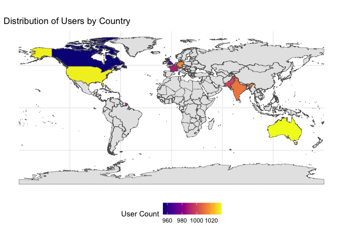
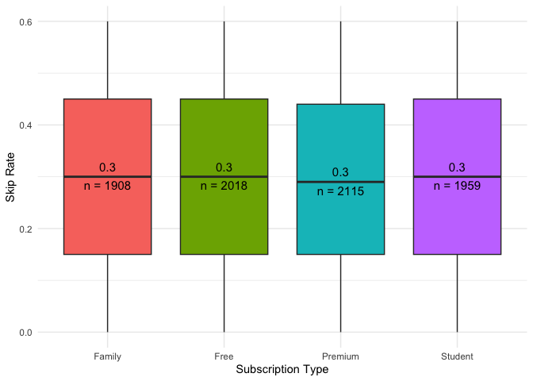

# Programming for Business Analytics (PBA) – Final Project
(Ken) Kanokphan Thananchai - 112065431, (Fern) Wachiraporn Tianchot -
112550081

- [**Part 1: Data and Proposal**](#part-1-data-and-proposal)
  - [**Data resource**](#data-resource)
  - [**Proposal**](#proposal)
  - [**Purpose**](#purpose)
  - [**Variables**](#variables)
  - [**Questions**](#questions)
- [**Part 2: Data Visualization**](#part-2-data-visualization)
  - [Set Up the envionment](#set-up-the-envionment)
  - [Visualization No.1](#visualization-no1)
  - [Visualization No.2](#visualization-no2)
  - [Visualization No.3](#visualization-no3)
  - [Visualization No.4](#visualization-no4)
  - [Visualization No.5](#visualization-no5)
  - [Visualization No.6](#visualization-no6)

## **Part 1: Data and Proposal**

### **Data resource**

- [\[Kaggle\] Spotify Analysis Dataset
  2025](https://www.kaggle.com/datasets/nabihazahid/spotify-dataset-for-churn-analysis)

### **Proposal**

We will analyze Spotify dataset with user-level behavior (listening
time, skips), plan type (Free/Premium), ads exposure, devices,
demographics, and a churn flag. This lets us explore engagement patterns
and illustrate churn/upgrade dynamics in a transparent, visual way.

### **Purpose**

Explain who is active, who is likely to churn, and who is likely to
upgrade to Premium then translate those insights into simple, testable
actions (upsell targeting, ad-light trials, playlist nudges) to improve
retention and conversion.

### **Variables**

- user_ID → Unique identifier for each user

- gender → Male/Female/Other

- age → User age

- country → User Location

- subscription_type → Free, Premium, Family, Student

- listening_time → Minutes spent listening per day

- songs_played_per_day → Number of songs played daily

- skip_rate → Percentage of songs skipped

- device_type → Device used (Mobile, Desktop, Web)

- ads_listened_per_week → Number of ads heard per week

- offline_listening → Offline mode usage

- is_churned → Target variable (0 = Active, 1 = Churned)

### **Questions**

1.  Which countries have the most active Spotify users?

2.  Which countries have the most premium or free Spotify users?

3.  How do listening time and songs played per day vary across age
    groups and gender?

4.  Which factors (listening_time, skip_rate, ads exposure, device, age)
    best predict churn probability?

5.  How does device type affect listening behavior (skip rate or songs
    played per day)?

6.  How do ads listening weekly relate to listening time and skip rate?

7.  Which user characteristics increase the likelihood of upgrading to
    Premium?

## **Part 2: Data Visualization**

### Set Up the envionment

- Load the libraries

``` r
library(ggplot2)
library(dplyr)
```


    Attaching package: 'dplyr'

    The following objects are masked from 'package:stats':

        filter, lag

    The following objects are masked from 'package:base':

        intersect, setdiff, setequal, union

``` r
library(sf)
```

    Linking to GEOS 3.13.0, GDAL 3.8.5, PROJ 9.5.1; sf_use_s2() is TRUE

``` r
library(rnaturalearth)
library(stringr)
library(scales)
```

- Load data

``` r
data <- read.csv("spotify_churn_dataset.csv")
```

- Useful function

  - This function will create a label for the MEDIAN - for Boxplot

    ``` r
    fun_median_label <- function(y) {
      return(data.frame(y = median(y), 
                        label = round(median(y), 1)))
    }

    # This function will create a label for the COUNT (n)
    fun_n_label <- function(y) {
      return(data.frame(y = median(y), 
                        label = paste0("n = ", length(y))))
    }
    ```

  - This function will create a label for the COUNT (n) - for Boxplot

    ``` r
    fun_n_label <- function(y) {
      return(data.frame(y = median(y), 
                        label = paste0("n = ", length(y))))
    }
    ```

### Visualization No.1

Count the number of users per country

``` r
data_fixed <- data %>%
  mutate(country = case_when(
    country == "UK" ~ "GB",  # When country is "UK", change it to "GB"
    TRUE ~ country           # Otherwise (TRUE), keep the original code
  ))

country_counts <- data_fixed %>%
  count(country, name = "user_count")

print(country_counts)
```

      country user_count
    1      AU       1034
    2      CA        954
    3      DE       1015
    4      FR        989
    5      GB        966
    6      IN       1011
    7      PK        999
    8      US       1032

Get the world map data

``` r
world_map <- ne_countries(scale = "medium", returnclass = "sf")

# Join your user counts with the map data
# This join will now work for "GB" (formerly "UK") and "FR"
world_map_with_data <- world_map %>%
  left_join(country_counts, by = c("iso_a2_eh" = "country"))

# Create the map visualization
ggplot(data = world_map_with_data) +
  geom_sf(aes(fill = user_count)) +
  scale_fill_viridis_c(
    option = "plasma",
    na.value = "grey90",
    name = "User Count"
  ) +
  labs(title = "Distribution of Users by Country") +
  theme_minimal() +
  theme(legend.position = "bottom")
```



**Table 1:** Active Spotify users by country

### Visualization No.2

``` r
# 1. Clean the subscription_type column
data_cleaned_for_bar_chart <- data_fixed %>%
  mutate(
    subscription_clean = str_to_title(str_trim(subscription_type))
  )

# 2. Count users by country AND subscription type
#    (Using 'country' as requested)
country_sub_counts <- data_cleaned_for_bar_chart %>%
  count(country, subscription_clean, name = "user_count")

# 3. Calculate total users per country
#    (This data frame will be used for the top labels)
country_totals <- country_sub_counts %>%
  group_by(country) %>%
  summarise(total_users = sum(user_count))

# 4. Prepare data for the stacked segments
plot_data <- country_sub_counts %>%
  left_join(country_totals, by = "country") %>%
  mutate(
    percentage = user_count / total_users,
    # Create the internal label (count + percent)
    label_text = paste0(user_count, "\n(", percent(percentage, accuracy = 0.1), ")")
  )

# 5. Create the stacked bar chart
ggplot(
  plot_data,
  
  # Reorder the x-axis by the 'total_users' (most to least)
  aes(x = reorder(country, -total_users), 
      y = user_count, 
      fill = subscription_clean)
) +
  # ---
  # Layer 1: The stacked bars
  geom_bar(stat = "identity", position = "stack") +
  
  # ---
  # Layer 2: The internal labels (count + percentage)
  geom_text(
    aes(label = label_text), 
    position = position_stack(vjust = 0.5), # Center label in each stack
    color = "black", 
    size = 3
  ) +
  
  # ---
  # Layer 3: The total count label on top of each bar
  # ---
  geom_text(
    data = country_totals, # Use the separate totals data
    aes(x = reorder(country, -total_users), # Must match the main x-axis
        y = total_users, 
        label = total_users),
    inherit.aes = FALSE,    # Stop this layer from using the 'fill' aesthetic
    vjust = -0.5,           # Nudge label just above the bar
    color = "black",
    size = 4
  ) +
  # ---

  # Improve styling
  scale_fill_brewer(palette = "Set2", name = "Subscription Type") +
  labs(
    title = "Users by Country and Subscription Type",
    x = "Country",
    y = "Total User Count"
  ) +
  theme_minimal() +
  # Give the top label a little extra room
  ylim(0, max(country_totals$total_users) * 1.05)
```


### Visualization No.3

``` r
# 1. Create the age groups (Your code)
data_with_age_groups <- data %>%
  mutate(
    age_group = cut(age, 
                    # We define the "breaks" for each group
                    breaks = c(0, 19, 29, 39, 49, 59, Inf),
                    # And give those groups names
                    labels = c("Under 20", "20-29", "30-39", "40-49", "50-59", "60+"),
                    right = TRUE)
  )

# 3. Create the box plot with labels
ggplot(data_with_age_groups, 
       aes(x = age_group, y = listening_time, fill = age_group)) +
  
  # This creates the box plot
  geom_boxplot() +
  
  # ---
  # 4. Add the labels (New part)
  # ---
  # Add the MEDIAN label (places it just ABOVE the median line)
  stat_summary(fun.data = fun_median_label, 
               geom = "text", 
               vjust = -0.7,  # Nudge it up
               color = "black", 
               size = 3.5) +
  
  # Add the COUNT label (places it just BELOW the median line)
  stat_summary(fun.data = fun_n_label, 
               geom = "text", 
               vjust = 1.5,   # Nudge it down
               color = "black",
               size = 3.5) +
  
  guides(fill = "none") + # Hide the legend, the x-axis is clear
  labs(
    title = "Listening Time Across Age Groups",
    x = "Age Group",
    y = "Listening Time (minute per day)"
  ) +
  theme_minimal()
```


### Visualization No.4

``` r
# ---
# Plot: Free and Premium differ in `skip_rate`
# ---
ggplot(data, 
       aes(x = subscription_type, y = skip_rate, fill = subscription_type)) +
  geom_boxplot() +
  
  # Add the MEDIAN label
  stat_summary(fun.data = fun_median_label, 
               geom = "text", 
               vjust = -0.7,
               color = "black", 
               size = 4) +
  
  # Add the COUNT label
  stat_summary(fun.data = fun_n_label, 
               geom = "text", 
               vjust = 1.5,   # Nudge it down
               color = "black",
               size = 4) +
  
  guides(fill = "none") + # Hide legend
  labs(
    x = "Subscription Type",
    y = "Skip Rate"
  ) +
  theme_minimal()
```



### Visualization No.5

``` r
# ---
# Plot: `device_type` differ in `listening_time`
# ---
ggplot(data, 
       aes(x = device_type, y = listening_time, fill = device_type)) +
  geom_boxplot() +
  
  # Add the MEDIAN label
  stat_summary(fun.data = fun_median_label, 
               geom = "text", 
               vjust = -0.7,
               color = "black", 
               size = 4) +
  
  # Add the COUNT label
  stat_summary(fun.data = fun_n_label, 
               geom = "text", 
               vjust = 1.5,   # Nudge it down
               color = "black",
               size = 4) +
  
  guides(fill = "none") + # Hide legend
  labs(
    x = "Device Type",
    y = "Listening Time (minute per day)"
  ) +
  theme_minimal()
```


### Visualization No.6

``` r
# ---
# Plot: `device_type` differ in `songs_played_per_day`
# ---
ggplot(data, 
       aes(x = device_type, y = songs_played_per_day, fill = device_type)) +
  geom_boxplot() +
  
 # Add the MEDIAN label (places it just ABOVE the median line)
  stat_summary(fun.data = fun_median_label, 
               geom = "text", 
               vjust = -0.7,  # Nudge it up
               color = "black", 
               size = 3.5) +
  
  # Add the COUNT label (places it just BELOW the median line)
  stat_summary(fun.data = fun_n_label, 
               geom = "text", 
               vjust = 1.5,   # Nudge it down
               color = "black",
               size = 3.5) +
  
  guides(fill = "none") + # Hide the legend, the x-axis is clear
  labs(
    x = "Device Type",
    y = "Songs Played Per Day"
  ) +
  theme_minimal()
```


