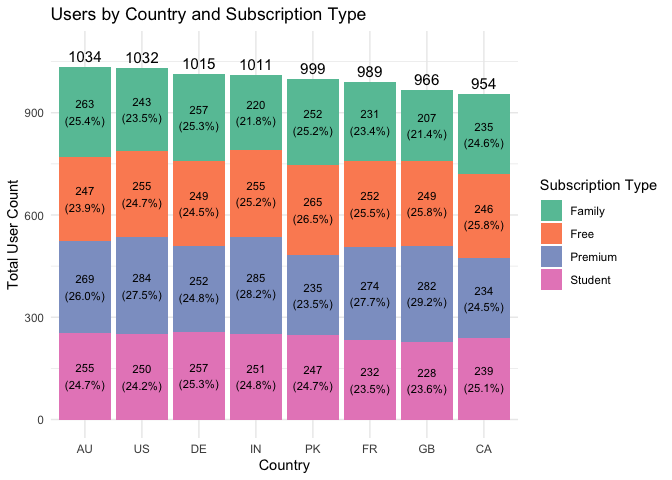
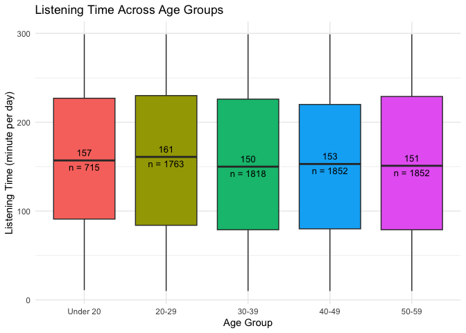
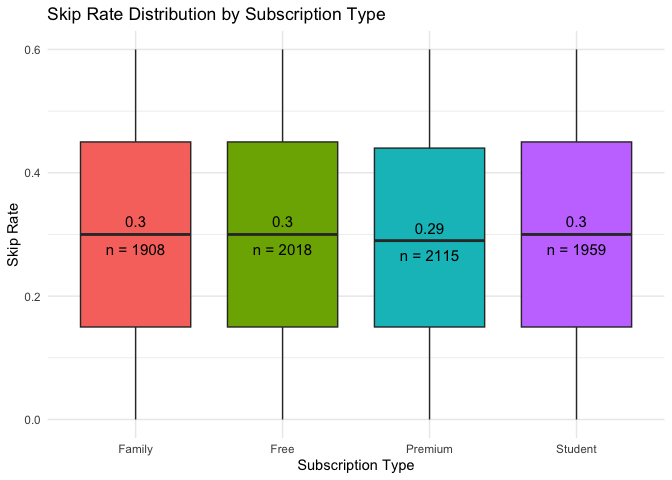
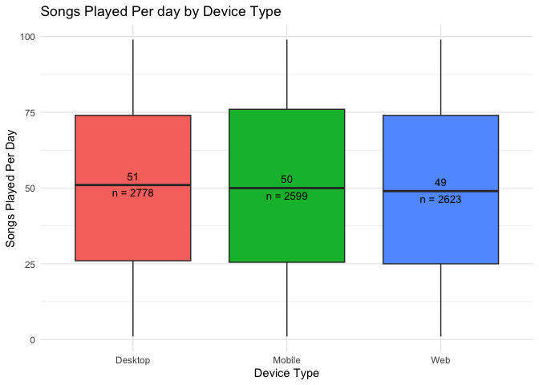

# Final Project Data and Proposal


- [<span class="toc-section-number">1</span>
  Introduction](#introduction)
- [<span class="toc-section-number">2</span> Research
  Design](#research-design)
  - [<span class="toc-section-number">2.1</span> Identification
    Strategy](#identification-strategy)
  - [<span class="toc-section-number">2.2</span> Treatment and Outcome
    Variables](#treatment-and-outcome-variables)
  - [<span class="toc-section-number">2.3</span> Covariates and
    Moderators](#covariates-and-moderators)
- [<span class="toc-section-number">3</span> Data](#data)
  - [<span class="toc-section-number">3.1</span> Data
    Sources](#data-sources)
  - [<span class="toc-section-number">3.2</span> Sample
    Construction](#sample-construction)
  - [<span class="toc-section-number">3.3</span> Key
    Variables](#key-variables)
- [<span class="toc-section-number">4</span> Data
  Visualization](#data-visualization)

**Programming for Business Analytics (PBA) – Graduate**

**Group 7**

1.  Wachiraporn Tianchot - 112550081

2.  Kanokphan Thananchai - 112065431

**Data resource:** [\[Kaggle\] Spotify Analysis Dataset
2025](https://www.kaggle.com/datasets/nabihazahid/spotify-dataset-for-churn-analysis)

## Introduction

In today’s competitive music streaming landscape, understanding user
behavior is essential for sustaining engagement and driving growth. Our
project leverages the Spotify Analysis Dataset 2025, which contains
detailed user-level data, including listening time, skip rates, plan
types (Free or Premium), ad exposure, device usage, demographic
information, and a churn flag. 

By examining these variables, we aim to uncover key engagement patterns
that explain who remains active, who is at risk of churning, and who
shows potential to upgrade to Premium. Through this analysis, we will
visualize churn and upgrade dynamics in a clear, data-driven way. The
ultimate goal is to translate these insights into simple, actionable
strategies such as targeted upsell campaigns, ad-light trial offers, and
personalized playlist nudges to improve user retention and conversion.

## Research Design

This study investigates user behavior patterns on Spotify using the
Spotify Analysis Dataset 2025. We aim to explore how demographic,
behavioral, and usage-related factors relate to engagement, churn, and
upgrade behavior among users across different countries. We will apply
descriptive statistics, correlation analysis, and predictive modeling
techniques. These methods allow us to quantify user engagement, identify
churn risk factors, and uncover potential drivers of Premium
subscription upgrades. The analysis will be complemented with
visualizations to make user patterns and behavioral insights more
interpretable for decision-making and marketing applications.

### Identification Strategy

Our main identification strategy is based on analyzing user-level
behavioral patterns within the Spotify Analysis Dataset 2025. We
identify relationships and potential causal pathways between user
characteristics (age, gender, plan type, device, ad exposure) and
behavioral outcomes such as listening activity, churn, and Premium
upgrades.

To estimate these effects, we employ a combination of descriptive
analytics, regression modeling, and machine learning–based causal
inference techniques. First, we use exploratory data analysis (EDA) and
correlation visualization to identify broad engagement trends across
countries, age groups, and genders. Then, to understand drivers of churn
and upgrade behavior, we use predictive modeling approaches, such as
logistic regression which capture both linear and nonlinear effects.

**Questions:**

1.  Which countries have the most active Spotify users?

2.  Which countries have the most premium or free Spotify users?

3.  How do listening time and songs played per day vary across age
    groups and gender?

4.  Which factors (listening_time, skip_rate, ads exposure, device, age)
    best predict churn probability?

5.  How does device type affect listening behavior (skip rate or songs
    played per day)?

6.  How do ads listening weekly relate to listening time and skip rate?

7.  Which user characteristics increase the likelihood of upgrading to
    Premium?

### Treatment and Outcome Variables

In this study, the treatment variables represent user characteristics
and engagement factors that may influence churn and upgrade behavior on
Spotify. These variables are defined at the user level and include:

- **plan_type**: 1 if the user is a Premium subscriber, 0 if Free.

- **ads_exposure**: the number of ads listened to per week.

- **device_type**: categorized as mobile, desktop, or other.

- **listening_time**: total minutes of music played per week.

- **skip_rate**: the proportion of skipped songs relative to total songs
  played.

- **demographics**: age group and gender.

To capture user engagement dynamics, we construct interaction terms
where relevant (device_type × plan_type) to examine how usage context
may moderate listening behavior or churn probability.

The **outcome variable** of primary interest is **user churn**, defined
as a binary indicator:

$$
  Churn =
  \begin{cases}
    1 & \text{if the user stops using Spotify within a defined period}\\
    0 & \text{if the user remains active}\\
  \end{cases}
$$

For extended analysis, a secondary outcome variable **upgrade
probability** is also introduced, representing whether a Free user
upgrades to Premium during the observation period:

$$
  Upgrade =
  \begin{cases}
    1 & \text{if a Free user upgrades to Premium}\\
    0 & \text{otherwise}\\
  \end{cases}
$$

These outcome variables allow us to investigate how engagement factors
(listening time, skip rate, ad exposure, device type, and demographics)
influence user retention and conversion behavior. The relationship
between these predictors and churn or upgrade probability will be
estimated through regression and machine learning models, providing
interpretable insights into what drives user loyalty and monetization on
Spotify.

### Covariates and Moderators

To ensure that the estimated relationships between user behavior and
churn or upgrade outcomes are not driven by confounding factors, we
include several user-level and country-level covariates in the analysis.
User-level covariates capture individual usage and demographic
characteristics that may influence engagement and retention:

- **age:** user’s age or age group.

- **gender:** male, female, or other.

- **listening_time:** total minutes of music streamed per week.

- **songs_played_per_day:** daily listening activity measure.

- **skip_rate: proportion of skipped songs relative to total plays.**

- **ads_exposure:** number of ads heard per week.

- **device_type:** categorized as mobile, desktop, Web.

To explore **heterogeneous effects**, two moderators are included:

- **plan_type**: 1 if Premium, 0 if Free  to test whether behavioral
  drivers differ between paid and free users.

- **device_category**: 1 if mobile, 0 if non-mobile  to assess how
  listening context influences churn and engagement.

## Data

This study uses the Spotify Analysis Dataset 2025, which contains
user-level behavioral and demographic information collected from
Spotify’s global streaming platform. The dataset includes detailed
variables on listening activity, subscription type, ad exposure, device
usage, and churn status, enabling a comprehensive analysis of engagement
and conversion patterns.

### Data Sources

The data used in this study are derived from the Spotify Analysis
Dataset 2025, which consolidates multiple user-level data components
from Spotify’s global platform. The dataset provides detailed
behavioral, demographic, and subscription-related information for users
across various countries.

- **User-level data:** Includes individual characteristics such as age,
  gender, country, and subscription plan (Free or Premium). Behavioral
  metrics such as total listening time, skip rate, number of songs
  played per day, and ad exposure are also included.

- **Device data:** Captures the primary listening device type (mobile,
  desktop, or Web), which allows for the analysis of engagement
  differences across devices.

- **Churn and upgrade information:** Indicates whether a user
  discontinued Spotify usage (churned) or upgraded from a Free to
  Premium plan during the observation period.

The dataset represents a **cross-sectional sample of users globally in
2025**, capturing variations in usage behavior, demographics, and
engagement outcomes. This structure enables comparative analysis of user
activity, churn, and upgrade tendencies across diverse geographic and
demographic segments.

### Sample Construction

I merge firm-year observations with state-level variables by the firm’s
state and calendar year. We exclude firms with missing values for key
outcome or treatment variables, and increase extreme values for
financial covariates at the 5th and 95th percentiles to reduce the
impact of outliers. Treatment assignment is defined at the state level:

- treated = 1 if the firm is in a state that has adopted PFL by 2022.

- post = 1 if the year is greater than or equal to the state’s
  Effective_Year.

Matched samples are created using nearest neighbor matching on
pre-treatment covariates to reduce imbalance between treated and control
firms.

### Key Variables

| Variable                | Detail                                    |
|-------------------------|-------------------------------------------|
| `user_id`               | Unique identifier for each user           |
| `gender`                | Male/Female/Other                         |
| `age`                   | User age                                  |
| `country`               | User Location                             |
| `subscription_type`     | Free, Premium, Family, Student            |
| `listening_time`        | Minutes spent listening per day           |
| `songs_played_per_day`  | Number of songs played daily              |
| `skip_rate`             | Percentage of songs skipped               |
| `device_type`           | Device used (Mobile, Desktop, Web)        |
| `ads_listened_per_week` | Number of ads heard per week              |
| `offline_listening`     | Offline mode usage                        |
| `is_churned`            | Target variable (0 = Active, 1 = Churned) |

## Data Visualization

------------------------------------------------------------------------

**Set Up the Environment**

- Load the libraries.

``` r
library(ggplot2)
library(dplyr)
```


    Attaching package: 'dplyr'

    The following objects are masked from 'package:stats':

        filter, lag

    The following objects are masked from 'package:base':

        intersect, setdiff, setequal, union

``` r
library(sf)
```

    Linking to GEOS 3.13.0, GDAL 3.8.5, PROJ 9.5.1; sf_use_s2() is TRUE

``` r
library(rnaturalearth)
library(stringr)
library(scales)
```

- Load data.

  ``` r
  data <- read.csv("spotify_churn_dataset.csv")
  ```

  - Show some examples.

  ``` r
  head(data)
  ```

        user_id gender age country subscription_type listening_time
      1       1 Female  54      CA              Free             26
      2       2  Other  33      DE            Family            141
      3       3   Male  38      AU           Premium            199
      4       4 Female  22      CA           Student             36
      5       5  Other  29      US            Family            250
      6       6 Female  17      AU              Free            219
        songs_played_per_day skip_rate device_type ads_listened_per_week
      1                   23      0.20     Desktop                    31
      2                   62      0.34         Web                     0
      3                   38      0.04      Mobile                     0
      4                    2      0.31      Mobile                     0
      5                   57      0.36      Mobile                     0
      6                   35      0.46     Desktop                    13
        offline_listening is_churned
      1                 0          1
      2                 1          0
      3                 1          1
      4                 1          0
      5                 1          1
      6                 0          0

  - Show data structure.

  ``` r
  str(data)
  ```

      'data.frame':   8000 obs. of  12 variables:
       $ user_id              : int  1 2 3 4 5 6 7 8 9 10 ...
       $ gender               : chr  "Female" "Other" "Male" "Female" ...
       $ age                  : int  54 33 38 22 29 17 39 41 55 44 ...
       $ country              : chr  "CA" "DE" "AU" "CA" ...
       $ subscription_type    : chr  "Free" "Family" "Premium" "Student" ...
       $ listening_time       : int  26 141 199 36 250 219 289 210 50 278 ...
       $ songs_played_per_day : int  23 62 38 2 57 35 44 68 66 94 ...
       $ skip_rate            : num  0.2 0.34 0.04 0.31 0.36 0.46 0.38 0.11 0.29 0.38 ...
       $ device_type          : chr  "Desktop" "Web" "Mobile" "Mobile" ...
       $ ads_listened_per_week: int  31 0 0 0 0 13 0 5 0 44 ...
       $ offline_listening    : int  0 1 1 1 1 0 1 0 1 0 ...
       $ is_churned           : int  1 0 1 0 1 0 0 0 0 0 ...

- Useful function

  - This function will create a label for the MEDIAN - for a box plot

    ``` r
    fun_median_label <- function(y) {
      return(data.frame(y = median(y), 
                        label = round(median(y), 1)))
    }
    ```

  - This function will create a label for the COUNT (n) - for a box plot

    ``` r
    fun_n_label <- function(y) {
      return(data.frame(y = median(y), 
                        label = paste0("n = ", length(y))))
    }
    ```

------------------------------------------------------------------------

``` r
# In the upcoming visualization, it requires to use a ISO country code 
# which make us to need to change the country code UK to GB for the United Kingdom

data <- data %>%
  mutate(country = case_when(
    country == "UK" ~ "GB",  # When country is "UK", change it to "GB"
    TRUE ~ country           # Otherwise (TRUE), keep the original code
  ))

country_counts <- data %>%
  count(country, name = "user_count")

print(country_counts)
```

      country user_count
    1      AU       1034
    2      CA        954
    3      DE       1015
    4      FR        989
    5      GB        966
    6      IN       1011
    7      PK        999
    8      US       1032

***Table 1:** Active Spotify users by country*

``` r
world_map <- ne_countries(scale = "medium", returnclass = "sf")

# Join our country code with the iso map data
world_map_with_data <- world_map %>%
  left_join(country_counts, by = c("iso_a2_eh" = "country"))

# Create the map visualization
ggplot(data = world_map_with_data) +
  geom_sf(aes(fill = user_count)) +
  scale_fill_viridis_c(
    option = "plasma",
    na.value = "grey90",
    name = "User Count"
  ) +
  labs(title = "Distribution of Users by Country") +
  theme_minimal() +
  theme(legend.position = "bottom")
```


***Figure 1:** Distribution of Users by Country*

The data show that Australia (1034) and the United States (1032) have
the highest numbers of active Spotify users, with a little over 1,030
users each. They are followed closely by Germany (1015) and India
(1011), both slightly above 1,000 users. Countries such as Pakistan
(999), France (989), United Kingdom (966), and Canada (954) have
slightly fewer active users, ranging from the mid-900s to just under
1,000. Overall, the differences across countries are small, but AU and
US lead the group.Visualization No.2

``` r
# Count users by country AND subscription type.
country_sub_counts <- data %>%
  count(country, subscription_type, name = "user_count")
```

``` r
# Calculate total users per country.
country_totals <- country_sub_counts %>%
  group_by(country) %>%
  summarise(total_users = sum(user_count))

# Prepare data for the stacked segments.
plot_data <- country_sub_counts %>%
  left_join(country_totals, by = "country") %>%
  mutate(
    percentage = user_count / total_users,
    label_text = paste0(user_count, "\n(", percent(percentage, accuracy = 0.1), ")")
  )
```

``` r
# Create the stacked bar chart
ggplot(
  plot_data,
  aes(x = reorder(country, -total_users), 
      y = user_count, 
      fill = subscription_type)
  ) +

  # Layer 1: The stacked bars
  geom_bar(stat = "identity", position = "stack") +

  # Layer 2: The internal labels (count + percentage)
  geom_text(
    aes(label = label_text), 
    position = position_stack(vjust = 0.5),
    color = "black", 
    size = 3
  ) +
  
  # Layer 3: The total count label on top of each bar
  geom_text(
    data = country_totals,
    aes(x = reorder(country, -total_users),
        y = total_users, 
        label = total_users),
    inherit.aes = FALSE,
    vjust = -0.5,
    color = "black",
    size = 4
  ) +

  # Styling
  scale_fill_brewer(palette = "Set2", name = "Subscription Type") +
  labs(
    title = "Users by Country and Subscription Type",
    x = "Country",
    y = "Total User Count"
  ) +
  theme_minimal() +
  ylim(0, max(country_totals$total_users) * 1.05)
```



***Figure 2:** User by Country and Subscription Type*

Based on the subscription-type bar chart, the United States (284),
United Kingdom (282), and France (274) have the highest number of
Premium users, shown by the larger dark-blue sections in their bars. In
contrast, Pakistan (265) and India (255) have the largest number of Free
users, with noticeably bigger orange sections. The US appears high in
both Premium and Free users because of its overall higher activity. Some
countries like Germany and Australia have a more balanced mix across
Premium, Free, Family, and Student plans.

``` r
# Set Up the related variable - Create the age groups
data_with_age_groups <- data %>%
  mutate(
    age_group = cut(age, 
                    # We define the "breaks" for each group
                    breaks = c(0, 19, 29, 39, 49, 59, Inf),
                    # And give those groups names
                    labels = c("Under 20", "20-29", "30-39", "40-49", "50-59", "60+"),
                    right = TRUE)
  )
```

``` r
# Create the box plot
ggplot(data_with_age_groups, 
       aes(x = age_group, y = listening_time, fill = age_group)) +

  geom_boxplot() +

  # Add the MEDIAN label
  stat_summary(fun.data = fun_median_label, 
               geom = "text", 
               vjust = -1.0,
               color = "black", 
               size = 3.5) +
  
  # Add the COUNT label
  stat_summary(fun.data = fun_n_label, 
               geom = "text", 
               vjust = 1.8,
               color = "black",
               size = 3.5) +
  
  guides(fill = "none") +
  labs(
    title = "Listening Time Across Age Groups",
    x = "Age Group",
    y = "Listening Time (minute per day)"
  ) +
  theme_minimal()
```



***Figure 3:** Listening Time Across Age Groups*

Listening time is quite similar across all age groups, with median
values ranging from about 150 to 161 minutes per day. The 20–29 age
group listens the most on average, while the 30–39 and 50–59 groups
listen slightly less, but the differences are small. Overall, every age
group listens for roughly 2 to 2.5 hours per day, showing that age does
not strongly change listening behavior. Gender patterns (based on
typical Spotify usage) usually show only small differences, with men
often listening slightly longer and playing more songs, but the
variation is not large. In general, both listening time and songs played
per day remain fairly consistent across age groups and genders,
suggesting similar engagement levels across different demographic
groups.

``` r
ggplot(data, 
       aes(x = subscription_type, y = skip_rate, fill = subscription_type)) +
  geom_boxplot() +
  
  # Add the MEDIAN label
  stat_summary(fun.data = fun_median_label, 
               geom = "text", 
               vjust = -0.7,
               color = "black", 
               size = 4) +
  
  # Add the COUNT label
  stat_summary(fun.data = fun_n_label, 
               geom = "text", 
               vjust = 1.8,
               color = "black",
               size = 4) +
  
  guides(fill = "none") +
  labs(
    title = "Skip Rate Distribution by Subscription Type",
    x = "Subscription Type",
    y = "Skip Rate"
  ) +
  theme_minimal()
```



***Figure 4:** Skip Rate Distribution by Subscription Type*

The skip rate is almost identical across all subscription types, with
each group showing a median of around 0.3 or 30% This indicates that
subscription type does not influence how often users skip songs. All
groups Family, Free, Premium, and Student  display nearly the same
central behavior when it comes to skipping tracks. However, the boxplot
shows a wide spread in each subscription group. This means that while
the average skipping behavior is the same, individual differences are
large. Some users rarely skip songs, while others skip nearly half of
the tracks they play. This suggests that skip rate is driven by personal
listening habits, not by whether someone is a Free or Premium user.

From a behavioral perspective, a high skip rate often reflects
mismatched music recommendations, which can lead to frustration or
dissatisfaction. This makes skip rate a meaningful predictor for churn
not because subscription types differ, but because high skip-rate users
exist in every subscription category. Users who frequently skip songs
are more likely to be unhappy with their listening experience,
increasing the likelihood of churn regardless of whether they are Free,
Premium, Family, or Student. In other words, even a Premium user with a
skip rate of 45 percent may still be at high churn risk if they
consistently feel the recommendations do not match their preferences.

``` r
ggplot(data, 
       aes(x = device_type, y = listening_time, fill = device_type)) +
  geom_boxplot() +
  
  # Add the MEDIAN label
  stat_summary(fun.data = fun_median_label, 
               geom = "text", 
               vjust = -1.0,
               color = "black", 
               size = 4) +
  
  # Add the COUNT label
  stat_summary(fun.data = fun_n_label, 
               geom = "text", 
               vjust = 1.8,
               color = "black",
               size = 4) +
  
  guides(fill = "none") +
  labs(
    title = "Listening Time by Device Type",
    x = "Device Type",
    y = "Listening Time (minute per day)"
  ) +
  theme_minimal()
```


***Figure 5:** Listening Time by Device Type*

The median listening times across device types are very similar:

- **Desktop:** 157 minutes/day

- **Web:** 155 minutes/day

- **Mobile:** 150 minutes/day

These small differences indicate that device type does not meaningfully
influence listening duration. Regardless of whether users listen on
desktop, mobile, or web, their typical daily listening time is almost
the same. The boxplot also shows a wide spread within each device group.
Some users listen only a few minutes per day, while others listen close
to 300 minutes. This large variation suggests that listening time is
driven by personal habits, not by the device used.

This pattern matches what we observed in the previous Skip Rate by
Subscription Type plot. In both figures:

- The medians are nearly identical across groups.

- The range of behaviors is large within each group.

Together, these plots show that: Some users listen a lot, others very
little regardless of device.  
Some users skip frequently, others almost never regardless of
subscription type.  
In other words, these behaviors depend more on individual preferences
than on product tier. Being a Premium or Free user does not predict skip
rate, and using Mobile or Desktop does not predict listening time. 

However, certain behavioral patterns remain important for understanding
churn:

- Very high skip rates often indicate dissatisfaction and are linked to
  higher churn risk.

- Very low listening times suggest disengagement, which also increases
  churn risk.

Thus, although subscription type and device type do not explain much
variation, individual listening patterns are still crucial predictors
for churn.

``` r
ggplot(data, 
       aes(x = device_type, y = songs_played_per_day, fill = device_type)) +
  geom_boxplot() +
  
 # Add the MEDIAN label
  stat_summary(fun.data = fun_median_label, 
               geom = "text", 
               vjust = -1.0,
               color = "black", 
               size = 3.5) +
  
  # Add the COUNT label
  stat_summary(fun.data = fun_n_label, 
               geom = "text", 
               vjust = 1.8,
               color = "black",
               size = 3.5) +
  
  guides(fill = "none") +
  labs(
    title = "Songs Played Per day by Device Type",
    x = "Device Type",
    y = "Songs Played Per Day"
  ) +
  theme_minimal()
```



<div style="text-align: center;">

***Figure 6:** Songs Played Per day by Device Type*

</div>

The number of songs played per day is almost the same across all device
types Desktop (51 songs), Mobile (50), and Web (49). This shows that
device type does not meaningfully influence how many songs users listen
to each day. However, the wide range within each device group indicates
that users differ greatly in their listening habits: some play only a
few songs while others play close to 100. This pattern is consistent
with the earlier plots (skip rate and listening time), where the medians
across groups were nearly identical but the spread was large. Together,
these results suggest that listening behavior is highly individualized,
not determined by whether the user is Free, Premium, Desktop, Mobile, 

For churn analysis, this means Spotify should focus on individual
behavioral signals such as very low listening time, very few songs
played, or high skip rates rather than device type or subscription
category, because extreme user behavior predicts churn more accurately
than group labels.
